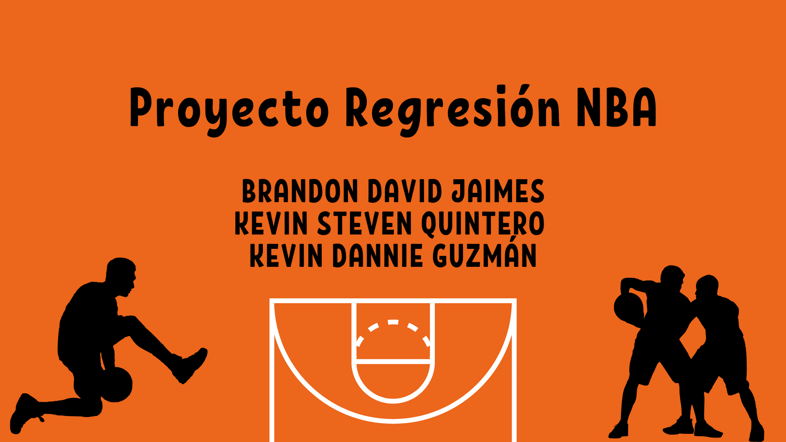

# NBA_Regresion

## Autores:

Brandon David Jaimes Castro, Kevin Steven Quintero, Kevin Dannie Guzman

## Objetivo:

Desarrollar un modelo de regresión que utilice datos históricos de partidos de la NBA para predecir los resultados de futuros encuentros. El modelo analizará diversas características de los partidos, como puntos,rebotes tiros libres, asistencias,canastas de 3 puntos, etc. Con el fin de proporcionar predicciones precisas sobre los resultados de los partidos.

## Dataset:

[Dataset NBA](https://www.kaggle.com/datasets/wyattowalsh/basketball/data)

se selecciono el csv de game del dataset

## Modelos:
- Decision tree
- Random Forest
- SVR
- DNN

## Enlaces:

[Codigo_Notebook](https://colab.research.google.com/drive/146auEtLQLDj4AD_XGkAHrkAtoxnohydF?usp=sharing#scrollTo=kPYemQDgIbv0)

[Video](https://youtu.be/KxQ9rVf7Th8)

[Repositorio](https://github.com/Fitman22/NBA_Regresion/tree/main)
